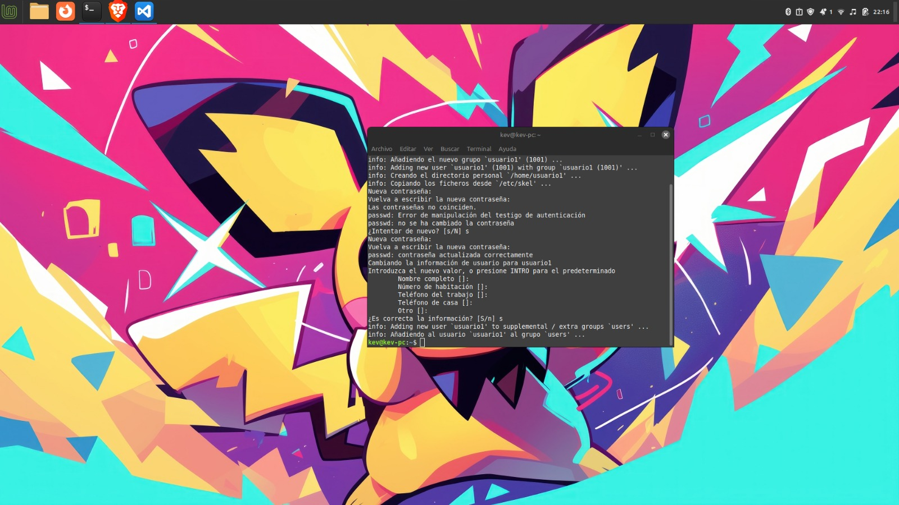
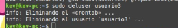
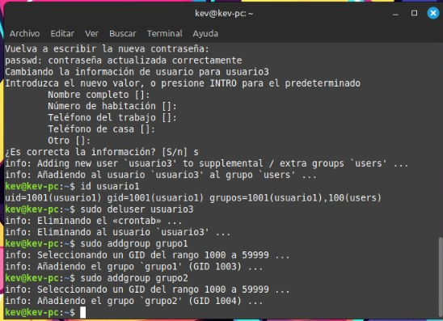
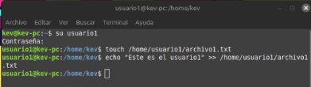

# Gestión de Permisos
# Parte 1: Gestión de Usuarios
- ### 📝 1.1 Creación de usuarios  y 🔒 1.2 Asignación de contraseñas

    Crea tres usuarios llamados `usuario1`, `usuario2` y `usuario3`. Establece una nueva contraseña para cada usuario creado.

    ```bash
    sudo adduser usuario1
    sudo passwd usuario1
    sudo adduser usuario2
    sudo passwd usuario2
    sudo adduser usuario3
    sudo passwd usuario3
    ```
    
- ### 📄 1.3 Información de Usuarios

    Muestra la información de `usuario1` usando el comando `id`.

    ```bash
    id usuario1
    ```
    
- ### ❌ 1.4 Eliminación de Usuario

    Elimina `usuario3`, pero conserva su directorio principal.

    ```bash
    sudo deluser usuario3
    ```

# Parte 2: Gestión de Grupos
- ### 📝 2.1 Creación de Grupos
    Crea un grupo llamado `grupo1` y `grupo2`.

    ```bash
    sudo addgroup grupo1
    sudo addgroup grupo2
    ```
- ### 📝 2.2 Agregar Usuarios a Grupos

    Agrega `usuario1` a `grupo1` y `usuario2` a `grupo2`.

    ```bash
    sudo adduser usuario1 grupo1
    sudo adduser usuario2 grupo2
    ```
    
- ### 📋 2.3 Verificar Membresía

    Verifica que los usuarios han sido agregados a los grupos utilizando el comando `groups`.

    ```bash
    groups usuario1
    groups usuario2
    ```
- ### ❌ 2.4 Eliminar Grupo

    Elimina `grupo2`.

    ```bash
    sudo delgroup grupo2
    ```

# Parte 3: Gestión de Permisos
- ### 📝 3.1 Creación de Archivos y Directorios

    - Como `usuario1`, crea un archivo llamado `archivo1.txt` en su directorio principal y escribe algo en él.

        ```bash
        su usuario1
        touch /home/usuario1/archivo1.txt
        echo "Este es el usuario1" >> /home/usuario1/archivo1.txt
        ```

        Creación del `archivo1.txt`:

        

    - Crea un directorio llamado `directorio1` y dentro de ese directorio, un archivo llamado `archivo2.txt`.

        ```bash
        mkdir directorio1
        cd directorio1
        touch archivo2.txt
        ```

        Creación del `directorio1` y `archivo2.txt`:

        
- ### 📋 3.2 Verificar Permisos

    Verifica los permisos del archivo y directorio usando el comando `ls -l` y `ls -ld` respectivamente.

    ```bash
    ls -l archivo1.txt
    ls -ld directorio1
    ls -l ./directorio1/archivo2.txt
    ```
- ### 📝 3.3 Modificar Permisos usando `chmod` con Modo Numérico

    Cambia los permisos del `archivo1.txt` para que sólo `usuario1` pueda leer y escribir (permisos `rw-`), el grupo pueda leer (permisos `r--`) y nadie más pueda hacer nada.

    ```bash
    chmod 640 archivo1.txt
    ```

- ### 📝 3.4 Modificar Permisos usando `chmod` con Modo Simbólico

    Agrega permiso de ejecución al propietario del `archivo2.txt`.

    ```bash
    chmod u+x archivo2.txt
    ```
- ### 📝 3.5 Cambiar el Grupo Propietario

    Cambia el grupo propietario de `archivo2.txt` a `grupo1`.

    ```bash
    chgrp grupo1 archivo2.txt
    ```
- ### 📝 3.6 Configurar Permisos de Directorio

    Cambia los permisos del `directorio1` para que sólo el propietario pueda entrar (permisos `rwx`), el grupo pueda listar contenidos pero no entrar (permisos `r--`), y otros no puedan hacer nada.

    ```bash
    chmod 740 directorio1
    ```
- ### 🔰 3.7 Comprobación de Acceso

    Intenta acceder al `archivo1.txt` y `directorio1/archivo2.txt` como `usuario2`. Nota cómo el permiso de directorio afecta el acceso a los archivos dentro de él.

    - Intento del `usuario2` de acceder al `archivo1.txt`:
    ```
    usuario2@kev-pc:/home/usuario1$ batcat directorio1/archivo1.txt
    [bat error] "./directorio1/archivo1.txt": Permision denied (os error 13)
    ```
    - Intento del `usuario2` de acceder al `directorio1/archivo2.txt`:

    ```
    usuario2@kev-pc:/home/usuario1$ batcat directorio1/archivo2.txt
    [bat error] "./directorio1/archivo2.txt": Permision denied (os error 13)
    ```
- ### 📋 3.8 Verificación Final

    Verifica los permisos y propietario de los archivos y directorio nuevamente con `ls -l` y `ls -ld`.

    ```bash
    ls -l archivo1.txt
    ls -ld directorio1
    ls -l ./directorio1/archivo2.txt
    ```
  - Verificando los permisos y propietario del  `usuario1`.
  ```
  usuario1@kev-pc:~$ ls -l archivo1.txt
  -rw-r----- 1 usuario1 usuario1 56 ago 4 19:07 archivo1.txt
  ```
  usuario1@kev-pc:~$ ls -ls directorio1
  - verificando los permisos y propietario del `directorio1`.
 ```
 drwxr----- 2 usuario1 usuario 1 4096 ago 4 19:13 directorio1
 ```

  ```
  usuario1@kev-pc:~$ ls -l ./directorio1/archivo2.txt
 -rxxrw-r-- 1 usuario1 grupo1 0 ago 4 19:13 directorio1/archivo2.txt
 ```
# 🤓 Reflexión

- ### ¿Por qué es importante gestionar correctamente los usuarios y permisos en un sistema operativo?
```
Porque dentro de un sistema operativo existen diferentes usuarios y cada uno de ellos tiene diferentes permisos, por lo que es importante gestionarlos correctamente para que cada usuario tenga los permisos que le fueron asignados para poder realizar sus tareas y no acceder a información que no se le permita dentro de sus permisos asignados.
```

- ### ¿Qué otros comandos o técnicas conocen para gestionar permisos en Linux?
    ```bash
    chown (Change Owner) # Cambia el propietario y el grupo de los archivos y directorios.
    umask (User Mask) # Establece permisos por defecto para nuevos archivos y directorios.
    usermod (User Modify) # Modifica la información de la cuenta de usuario.
    ```