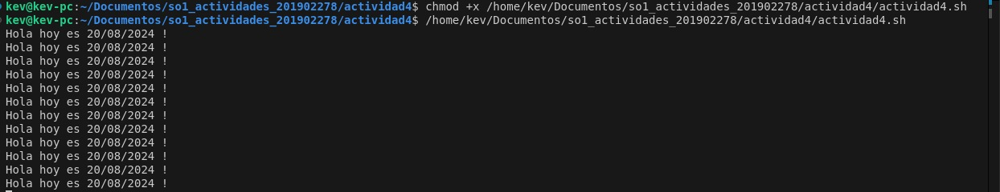

# 📜 Systemd Unit
---
#### Crear un systemd unit de tipo servicio para ejecutar un script imprima un saludo y la fecha actual.
```bash
#!/bin/bash

echo "Hola hoy es $(date +"%d/%m/%Y") !"
```
### Pasos para ejecutar el servicio 
1. Al archivo `actividad4` hay que darle los permisos de ejecución:
```bash
chmod +x actividad4.sh
```
2. Luego se debe crear el archivo `actividad4.service` en la carpeta `/etc/systemd/system/` con el siguiente contenido:
```bash
[Unit]
Description=Actividad 4 donde se muestra el saludo y la fecha en bucle

[Service]
ExecStart=/home/kev/Documentos/so1_actividades_201902278/actividad4/mi_servicio.sh
Restart=always
User=kev

[Install]
WantedBy=multi-user.target

```
3. Ya teniendo el servicio, se debe de habilitar el servicio con el siguiente comando:

```bash
sudo systemctl enable actividad4.service
```
4. Luego se debe de iniciar el servicio con el siguiente comando:

```bash
sudo systemctl start actividad4.service
```

5. Verificar que el servicio se este ejecutando con el siguiente comando:

```bash
sudo systemctl status actividad4.service
```
